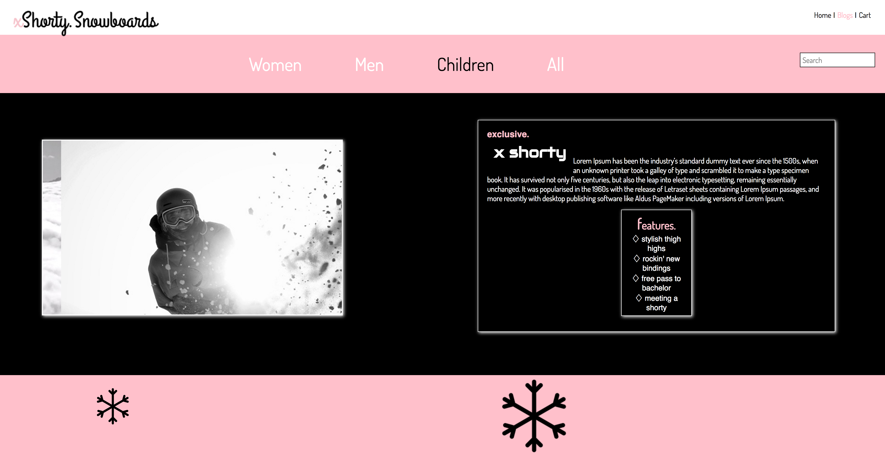

# _Megan Kaluza_

#### _Solo Project: Shorty Snowboards for Epicodus, Date: 11-18-16_

#### By _**Megan Kaluza**_

## Description

_Objectives:_

* _At least one centered element._

* _A list or summary of features (lorem ipsum is fine)._

* _At least one large image with an absolutely positioned caption._

* _At least one table or form field styled with CSS (e.g. sizing chart, color options, order form…)._

* _A gallery of smaller images (e.g. similar products...)._

* _Use of at least one pseudo class and one pseudo element._

* _Use of at least 3 different types of selectors._

* _Appropriate elements are positioned using absolute & relative positioning._

* _Gallery images make use of the float property._

* _Elements use box-sizing: border-box;_

* _Project is in a polished, portfolio-quality state._

## Setup/Installation Requirements

* _Clone this repository https://github.com/megankaluza/shorty-snowboards.git_
* _Open in browser of your choice_

_Install Sass_

* _gem install sass_
* _sass --watch ._

## Known Bugs

_No known bugs at this time_

## Support and contact details

_megan.kaluza@gmail.com_

## Technologies Used

* _HTML_
* _CSS_
* _SASS_
* _Google Fonts_
* _jQuery_
* _JavaScript_

### License

Copyright (c) 2016 **_Megan Kaluza_**

This software is licensed under the MIT license.

Permission is hereby granted, free of charge, to any person obtaining a copy of this software and associated documentation files (the "Software"), to deal in the Software without restriction, including without limitation the rights to use, copy, modify, merge, publish, distribute, sublicense, and/or sell copies of the Software, and to permit persons to whom the Software is furnished to do so, subject to the following conditions:

The above copyright notice and this permission notice shall be included in all copies or substantial portions of the Software.

THE SOFTWARE IS PROVIDED "AS IS", WITHOUT WARRANTY OF ANY KIND, EXPRESS OR IMPLIED, INCLUDING BUT NOT LIMITED TO THE WARRANTIES OF MERCHANTABILITY, FITNESS FOR A PARTICULAR PURPOSE AND NONINFRINGEMENT. IN NO EVENT SHALL THE AUTHORS OR COPYRIGHT HOLDERS BE LIABLE FOR ANY CLAIM, DAMAGES OR OTHER LIABILITY, WHETHER IN AN ACTION OF CONTRACT, TORT OR OTHERWISE, ARISING FROM, OUT OF OR IN CONNECTION WITH THE SOFTWARE OR THE USE OR OTHER DEALINGS IN THE SOFTWARE.
